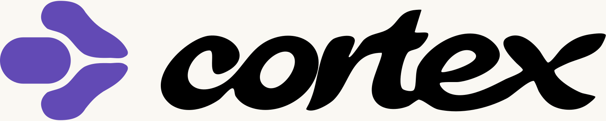

<p align="center">
  <a href="https://pablomanjarres.com/oss/cortex"></a>
</p>

<p align="center"></p>

Cortex is a local-first macOS dashboard for daily plans, habits, coursework, contacts, calendars, and finances. Personal data stays encrypted on your Mac. A local API and MCP server let agents work with the same records.

[App page](https://pablomanjarres.com/oss/cortex) · [Project notes](https://pablomanjarres.com/portfolio/projects/cortex)

## Run locally

Requires macOS on Apple Silicon and Node.js 22.12 or newer.

```bash
npm install
npm run electron:dev
```

For a web-only development view, run `npm run dev`. Native calendar and Keychain features require Electron.

## Build

```bash
npm test
npm run electron:build
```

The packaged app is written to `release/mac-arm64/Cortex.app`. Back up the installed app before replacing it.

## Agent access

Keep Cortex running, then build its MCP server:

```bash
cd mcp-server
npm install
npm run build
```

Point your MCP client at `node /absolute/path/to/cortex/mcp-server/dist/index.js`. The server uses the app's local API on port 3456. Phone access requires your own Tailscale network.

Cloud billing setup is in [docs/cloud-cost-setup.md](docs/cloud-cost-setup.md). Use read-only cloud credentials.

## Brand assets

The original abstract symbol, custom lettering, and combined logo live in [public/brand](public/brand). Run `npm run brand:generate` to rebuild the app, tray, favicon, and PWA icons from the symbol SVG.

## License

[MIT](LICENSE).
